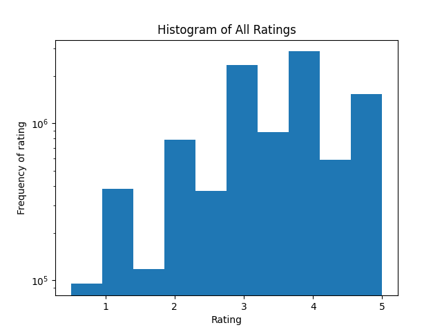
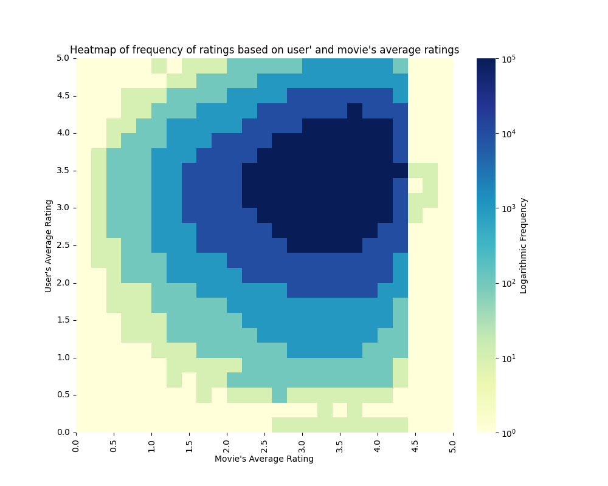

# **SUB-COFI**
Study of Unfairness Bias in Collaborative Filtering

## **Data Analysis**
---
### **MovieLens 10M**

- Download the dataset from [here](https://grouplens.org/datasets/movielens/10m/).
- **Basic statistics of the MovieLens 10M dataset**:
  - Unique users: 69878
  - Unique movies: 10677
  - Total ratings: 10000054
  - Average ratings per user: 143.51
  - Average ratings per movie: 935.40
  - Average rating: 3.51
  
   

- **Rating Distributions**
  
    **Distribution of all ratings**| **Distribution of average ratings per user**
    :-------------------------:|:-------------------------:
      |  
    **Distribution of average ratings per movie**| **Heatmap of frequency of ratings in the dataset   per (user average rating, movie average rating)**
      |  

- **Dataset tasks**
  - a) **Predicting ratings**: Given a user and a movie, predict the rating that the user would give to the movie.
    - Labels of the ratings are in the range [0.5, 5.0] with a step of 0.5. -> __Interesting for analyzing unfairness bias__
    - Evaluation metrics: RMSE, MAE, MAPE, R2
    - SOTA top models: [10M Dataset](https://paperswithcode.com/sota/collaborative-filtering-on-movielens-10m), [1M Dataset](https://paperswithcode.com/sota/collaborative-filtering-on-movielens-1m), [100k Dataset](https://paperswithcode.com/sota/collaborative-filtering-on-movielens-100k)
    - No bias analysis in any of the publications with Top10 RMSE. 
  - b) **Top-N recommendation**: Given a user, recommend the top-N movies that the user would like the most.
    - Labels of the ratings are 0 or 1 (binary classification). We consider a movie to be liked by a user (1) if the rating is greater than or equal to 4.0. Otherwise, the label is not kept. **(?)**
    - Evaluation metrics: Precision, Recall, F1, NDCG, AUC

## **Model Execution and Evaluation**
### **MovieLens 10M**

- Progress status codes: 
  - 🚦 Not started
  - 🕑 Running
  - 🏁 Completed execution
  - 🗻 Analysis finished
  - ⚠️ Execution problem (solution in progress)
  - 🔗‍💥 Code not available

| **Model  (click for results)** | **Progress** | **RMSE (Reported)** | **RMSE (Reproduced)** | **Source Code** | **Paper** | **Comments** |
|:---:|:---:|:---:|:---:|:---:|:---:|:---:|
| Sparse FC | 🏁 | 0.769 | 0,770 |  [Link](https://proceedings.mlr.press/v80/muller18a.html) | [Supplementary zip](https://proceedings.mlr.press/v80/muller18a.html) |
| MRMA | 🕑 |  |  |  |  |  |
| Bayesian time SVD++ Flipped | 🚦 |  |  |  |  |  |
|  |  |  |  |  |  |  |